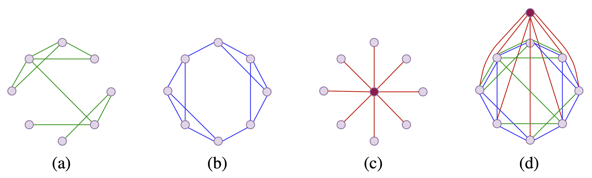

# Exphormers: Sparse Transformers for Graphs


[](https://arxiv.org/abs/2303.06147)
[](https://paperswithcode.com/sota/graph-classification-on-cifar10-100k?p=exphormer-sparse-transformers-for-graphs)
[](https://paperswithcode.com/sota/node-classification-on-coco-sp?p=exphormer-sparse-transformers-for-graphs)
[](https://paperswithcode.com/sota/graph-classification-on-malnet-tiny?p=exphormer-sparse-transformers-for-graphs)
[](https://paperswithcode.com/sota/graph-classification-on-mnist?p=exphormer-sparse-transformers-for-graphs)
[](https://paperswithcode.com/sota/node-classification-on-pascalvoc-sp-1?p=exphormer-sparse-transformers-for-graphs)
[](https://paperswithcode.com/sota/link-prediction-on-pcqm-contact?p=exphormer-sparse-transformers-for-graphs)





In this work we introduce new sparse transformers for graph data, and use them in the [GraphGPS](https://github.com/rampasek/GraphGPS) framework. Our sparse transformers outperform BigBird and Performer in all cases we tried, which have been mainly designed for the natural language processing context; in many cases, we even get better results than full (dense attention) transformers. Our sparse transformer has three components: actual edges, expander graphs, and universal connectors or virtual nodes. We combine these components into a single sparse attention mechanism.


### Python environment setup with Conda

```bash
conda create -n exphormer python=3.9
conda activate exphormer

conda install pytorch=1.10 torchvision torchaudio -c pytorch -c nvidia
conda install pyg=2.0.4 -c pyg -c conda-forge

# RDKit is required for OGB-LSC PCQM4Mv2 and datasets derived from it.  
conda install openbabel fsspec rdkit -c conda-forge

pip install torchmetrics
pip install performer-pytorch
pip install ogb
pip install tensorboardX
pip install wandb

conda clean --all
```


### Running Exphormer
```bash
conda activate exphormer

# Running Exphormer for LRGB Datasets
python main.py --cfg configs/Exphormer_LRGB/peptides-struct-EX.yaml  wandb.use False

# Running Exphormer for Cifar10
python main.py --cfg configs/Exphormer/cifar10.yaml  wandb.use False
```
You can also set your wandb settings and use wandb.

### Guide on configs files

Most of the configs are shared with [GraphGPS](https://github.com/rampasek/GraphGPS) code. You can change the following parameters in the config files for different parameters and variants of the Exphormer:
```
prep:
  exp: True  # Set True for using expander graphs, set False otherwise. 
    # Alternatively you can set use_exp_edges to False.
    # In this case expander graphs will be calculated but not used in the Exphormer. 
  exp_deg: 5 # Set the degree of the expander graph.
    # Please note that if you set this to d, the algorithm will use d permutations 
    # or d Hamiltonian cycles, so the actual degree of the expander graph will be 2d
  exp_algorithm: 'Random-d' # Options are ['Random-d', 'Random-d2', 'Hamiltonian].
    # Default value is 'Random-d'
  add_edge_index: True # Set True if you want to add real edges beside expander edges
  num_virt_node: 1 # Set 0 for not using virtual nodes 
    # otherwise set the number of virtual nodes you want to use.
```

## Citation

Our work can be cited using the following bibtex:
```bibtex
@inproceedings{shirzad2023exphormer,
  title={Exphormer: Sparse transformers for graphs},
  author={Shirzad, Hamed and Velingker, Ameya and Venkatachalam, Balaji and Sutherland, Danica J and Sinop, Ali Kemal},
  booktitle={International Conference on Machine Learning},
  eprinttype={arXiv}, eprint={2303.06147},
  year={2023}
}
```
